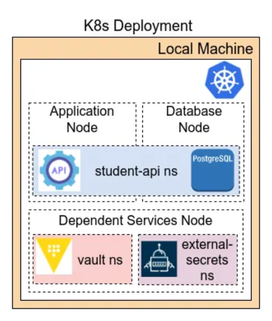
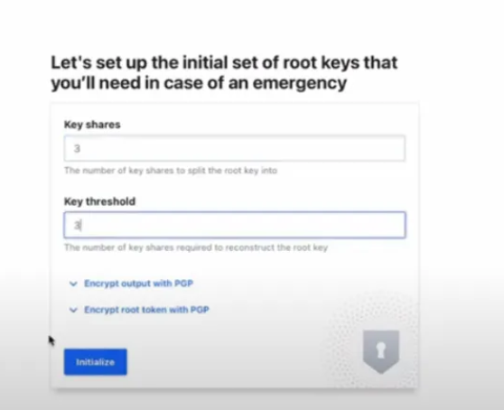
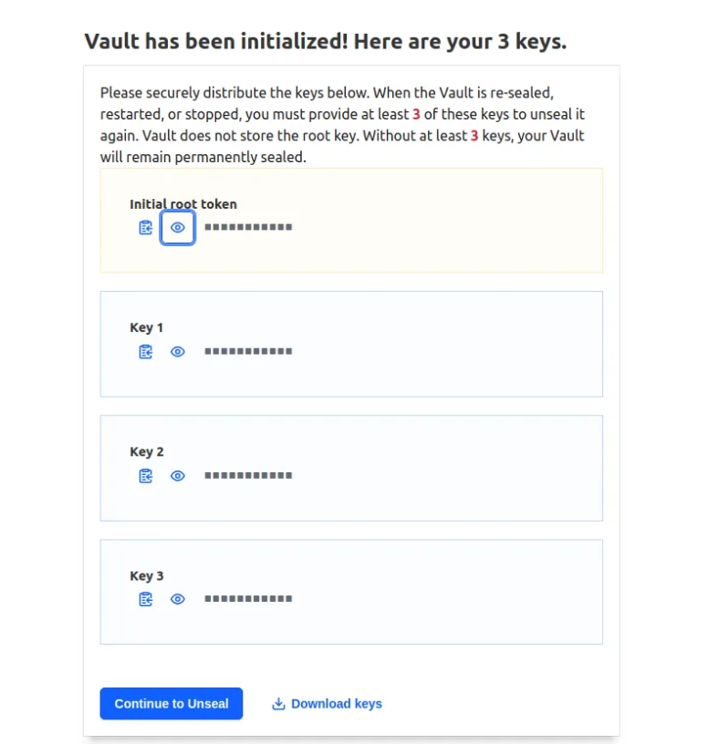
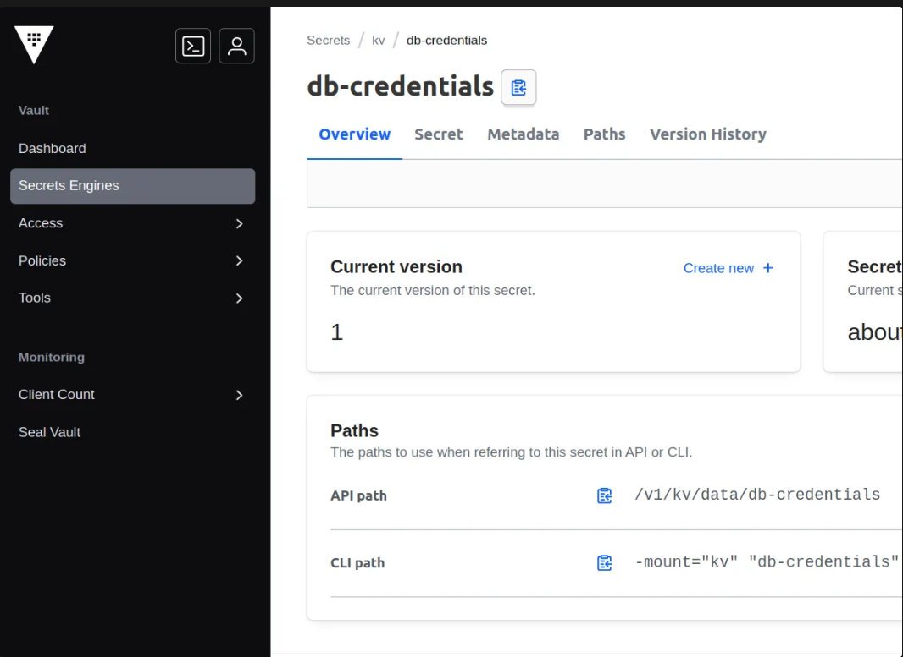

# Go CRUD Application - Kubernetes Deployment

This repository contains the Kubernetes manifests for deploying a REST API application (a Go-based CRUD app) along with its dependent services (Vault, ESO) on a Kubernetes cluster. The deployment leverages modern practices such as ConfigMaps for non-sensitive configuration, the External Secrets Operator (ESO) for secure injection of sensitive data from HashiCorp Vault, and init containers for running database migrations.

## Project Overview

### Application Components

1. **Go CRUD App**: The primary application to handle CRUD operations.
2. **PostgreSQL Database**: Backend database for data storage.
3. **HashiCorp Vault**: Central system for secret storage.
4. **External Secrets Operator**: Syncs secrets from Vault to Kubernetes.
5. **Ingress Controller**: Manages external access to services.

### Kubernetes Features Used

- ConfigMaps for non-sensitive configurations.
- Secrets for sensitive data (managed via Vault and External Secrets Operator).
- Deployments for managing pods.
- Services for exposing the application and database.
- Ingress for HTTP routing.
- Helm for managing Vault installation.
- Makefile for streamlined deployment and management.

## 🏗️ Architecture Diagram

Below is the high-level architecture of the deployment:



## Setup Instructions

### 1. Start Kubernetes Cluster

For local testing with Minikube, use the following command:

```bash
minikube start --driver=virtualbox
```

### 2. Deploy Components Using Makefile

Use the `Makefile` to simplify deployment:

```bash
make deploy
```

This will:

- Apply ConfigMaps and namespaces.
- Deploy Vault using Helm.
- Create required secrets.
- Deploy PostgreSQL.
- Deploy the Go CRUD application.
- Apply ingress for external access.

### 3. Verify Deployment

Check the status of the deployments, services, and ingress:

```bash
kubectl get pods
kubectl get svc
kubectl get ingress
```

### 4. Access the Application

Once deployed, access the application via ingress:

```bash
curl http://go-crud-app.local/health/
```

Ensure the domain is added to `/etc/hosts` if running locally.

## Managing Secrets with Vault

### 1. Install Vault

Vault is installed using Helm:

```bash
helm repo add hashicorp https://helm.releases.hashicorp.com
helm repo update
helm install vault hashicorp/vault --namespace vault-ns --version 0.29.1
```

### 2. Create Vault Token Secret

```bash
kubectl create secret generic vault-token -n external-secrets-ns --from-literal=token="YourToken"
```

## 🏗️ Vault UI

Below are hashicorp vault UI:





## License

This project is licensed under the MIT License.

## Support

For questions or issues, please raise a GitHub issue or contact the maintainer.

