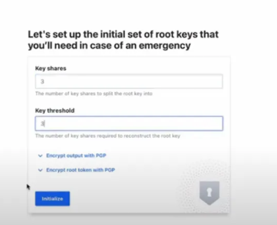
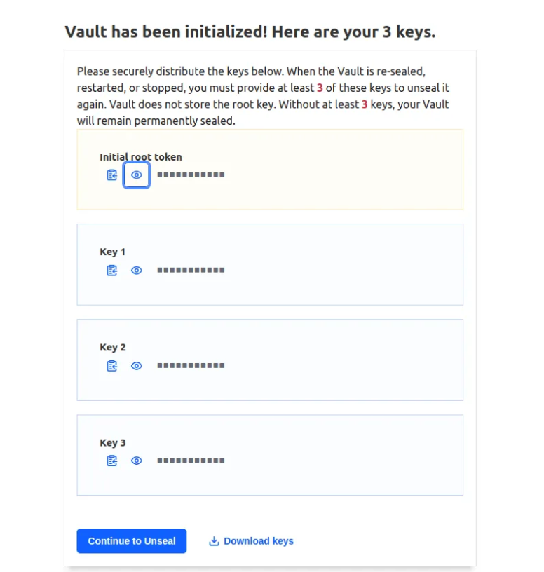
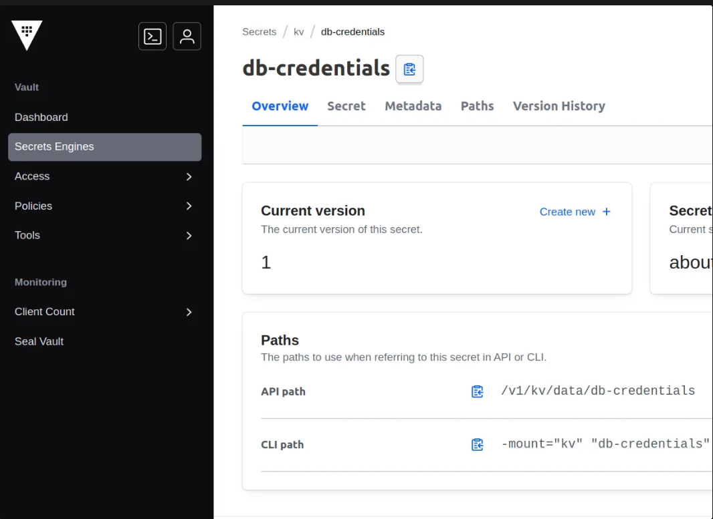

# Go CRUD Application - Kubernetes Deployment

This repository contains Helm charts for deploying a Go-based CRUD API application along with its dependent services (PostgreSQL, Vault, and External Secrets Operator) on a Kubernetes cluster. It follows modern Kubernetes best practices by utilizing Helm for deployments, ConfigMaps for non-sensitive configurations, and the External Secrets Operator (ESO) for securely injecting secrets from HashiCorp Vault.

## Project Overview

### Application Components

- **Go CRUD App**: The primary REST API application for CRUD operations.
- **PostgreSQL Database**: Backend database for storing application data.
- **HashiCorp Vault**: A secure secrets management system.
- **[External Secrets Operator](https://external-secrets.io/latest/introduction/getting-started/)**: Syncs secrets from Vault to Kubernetes.
- **Ingress Controller**: Manages external access to services.

### Kubernetes Features Used

- **ConfigMaps** for managing non-sensitive configurations.
- **Secrets** for managing sensitive data (via Vault + ESO).
- **Deployments** for managing application pods.
- **Services** for exposing the application and database.
- **Ingress** for routing external HTTP requests.
- **Helm** for managing the deployment of Vault and other components.

## Setup Instructions

### 1. Start Kubernetes Cluster

For local testing with Minikube:

```bash
minikube start --driver=virtualbox
```

### 2. Deploy Components Using Helm

```bash
cd helm/go-crud-stack/
helm install go-crud-stack-test .
helm list
```

### 3. Access the Application

Once deployed, access the application via Ingress:

```bash
# If deployed locally
curl http://<YourReleaseName>-go-crud-app.local/health/
```

> Ensure the domain is added to `/etc/hosts` if running locally.

## Managing Secrets with Vault

### 1. Install Vault

Vault is installed using Helm:

```bash
helm repo add hashicorp https://helm.releases.hashicorp.com
helm repo update
helm install vault hashicorp/vault --namespace vault-ns --version 0.29.1
```

## Vault UI

Below are screenshots of the HashiCorp Vault UI:







## License

This project is licensed under the MIT License.

## Support

For questions or issues, please raise a GitHub issue or contact the maintainer.


